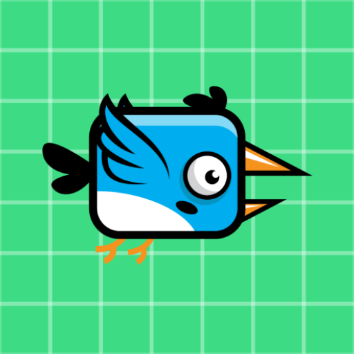

# INNOCENT BIRD GAME

**_Frontend:_**

**SplashScreen:**

Design an appealing splash screen using Android XML layout for an impactful initial experience.
Menu

**Interface:**

Create an interactive menu using XML layouts for seamless navigation and user engagement.

**Game Page:**

Develop the game page with a 2D game environment, incorporating Android Canvas and SurfaceView for rendering graphics.

**Bird Animation:**

Implement bird animations using Android AnimationDrawable or custom frame animations for a lively character.

**User Controls:**

Design intuitive touch controls, incorporating touch listeners for user input to navigate the bird.

**Lottie Animation Integration:**

Integrate Lottie animations within the UI for dynamic and expressive visuals, enhancing user interaction.

**Music Player UI:**

Design a media player interface for background music, allowing users to control the audio experience.

**Transition Screens:**

Create smooth transition screens between game phases and an ending screen for a polished user experience.

**Image Processing UI:**

Implement UI elements for image processing using Picasso, providing a visually enhanced gaming environment.
**___________________________________________________________________________________**

**_Backend:_**

**Firebase Integration:**

Configure Firebase in the Android project, connecting the app to the Firebase project for seamless backend services.

**Firebase Authentication:**

Implement Firebase Authentication for secure user login, signup, and password recovery.

**Firebase Realtime Database:**

Set up the Firebase Realtime Database for storing and retrieving dynamic game data, such as scores and user progress.

**Custom Email Verification:**

Implement custom email verification in the backend to enhance account security.

**API Integration:**

Connect to external APIs using Volley for dynamic content, such as game updates or additional features.

**Backend Logic:**

Develop backend logic for game events, collisions, and scoring to ensure smooth communication between frontend and backend.

**Scoring System:**

Design and implement a scoring system to track user progress and achievements.

**Game State Management:**

Implement logic for managing the game state, handling transitions between different game phases.

**Data Synchronization:**

Ensure synchronization between the frontend and backend, updating user data in real-time.

**Backend Optimization:**

_Optimize backend services for efficiency, minimizing latency and ensuring a responsive gaming experience.
By combining a well-designed frontend with a robust backend, the Android 2D game can offer a seamless and engaging experience for players, complete with dynamic visuals, responsive controls, and real-time data synchronization_

**Title: "Blue Bird Rescue Adventure"**

Objective: Save the innocent Blue Bird from the bees and collect points. Each coin gathered earns you 10 points. Be cautious, as touching a bee costs you one life, and you have three lives in total.

**Game Rules:**

Control the Blue Bird to navigate the environment.
Collect coins to score 10 points each.
Avoid touching the bees to preserve your three lives.
The game ends when you lose all three lives.

**Scoring:**

Collect Coin: +10 points
Touch Bee: -1 life

**Gameplay Tips:**

_Use precise controls to maneuver the Blue Bird safely.
Plan your moves strategically to avoid bee encounters.
Keep an eye on your life count and plan accordingly._

**Get ready to embark on the Blue Bird Rescue Adventure and showcase your skills in this exciting and challenging game!**

## **_Different Parts Screenshot_**

## **Login Page**

## **Registration Page**

## **Fortget password Page**

## **Home Page**

## **Game Rule**

## **About**

## **BackPressed**

## **Drawer**

## **Game End**

## **Game Home**

## **Other section**

# **_Design and Developed By_**

- [@Nafiul Hasan](https://github.com/NafiulHasan41)

# 🚀 **_About Me_**
## 👋 Hello, I'm [**_Nafiul Hasan_**]!

I am a passionate and versatile software developer with expertise in both the MERN (MongoDB, Express.js, React, Node.js) stack for web development and Android app development using Java and Kotlin. I thrive on building seamless and engaging digital experiences.

### 🌐 Web Development: MERN Stack

In the world of web development, I specialize in the MERN stack. From crafting robust backends with Node.js and Express.js to creating responsive and interactive user interfaces with React, I enjoy bringing ideas to life on the web. MongoDB serves as my preferred database, providing flexibility and scalability to applications.

### 📱 Mobile Development: Android (Java & Kotlin)

With a deep understanding of mobile development, I am proficient in building native Android applications using both Java and Kotlin. I believe in delivering apps that not only meet functional requirements but also offer a delightful user experience.

### 🚀 Continuous Learning: PHP Laravel and ASP.NET

My journey in software development is a continuous learning process. Currently, I am expanding my skill set by diving into PHP Laravel and ASP.NET. I am excited about the opportunities these technologies bring and am committed to staying at the forefront of industry trends.

### 🔧 What I Bring to the Table:

- **Full Stack Proficiency:** Capable of handling both frontend and backend development, ensuring end-to-end solutions.
- **Problem Solver:** Thrive on overcoming challenges with creative and efficient solutions.
- **Team Player:** Collaborative mindset, adept at working in cross-functional teams.
- **Passionate Learner:** Eager to explore new technologies and frameworks to stay ahead in the ever-evolving tech landscape.

### 🌟 Let's Connect!

I am always open to new projects, collaborations, and conversations within the tech community. Whether you're looking for a MERN stack developer, Android app developer, or someone exploring PHP Laravel and ASP.NET, feel free to reach out!

Connect with me on [LinkedIn](linkedin.com/in/nafiul-hasan-524274276) or drop me an email at [nafiulhasan125884@gmail.com ]. Looking forward to the exciting opportunities ahead!

